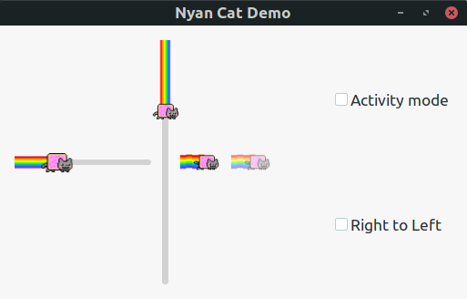

# gtk-nyan-cat

Nyan Cat progress bars and spinners for GTK+.



## Flavors

gtk-nyan-cat provides multiple nyan cat flavors. Check `flavors` directory.

## Install

```sh
./install.sh <flavor> <theme-path>
```

e.g.

```sh
sudo ./install.sh original /usr/share/themes/Matcha-sea/
```

And run `demo.py` or `demo.vala` to check the result.
